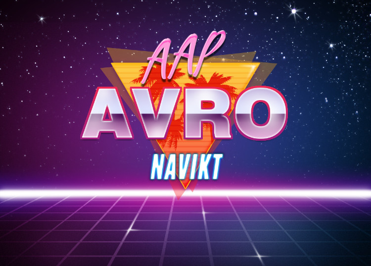

[](https://nav-it.slack.com/app_redirect?channel=C02CW21TBKR)
[](https://github.com/navikt/aap-avro/packages/1262528}?version=1.2.1)
[](https://github.com/navikt/aap-avro/packages/1271717}?version=2.0.0)
[](https://github.com/navikt/aap-avro/packages/1271715}?version=0.2.1)
[](https://github.com/navikt/aap-avro/packages/1271858}?version=0.0.9)

## 📚 Usage

#### Medlemskap (LovMe)

Topic `aap.medlem.v1` &nbsp;&nbsp;&nbsp;&nbsp;
Definition [topic-medlem.yml](https://github.com/navikt/aap-vedtak/blob/main/.nais/topic-medlem.yml) <br/>

```kotlin
implementation("no.nav.aap.avro:medlem:1.2.1")
```

#### Søker (internal domain)

Topic `aap.sokere.v1` &nbsp;&nbsp;&nbsp;&nbsp;
Definition [topic-søkere.yml](https://github.com/navikt/aap-vedtak/blob/main/.nais/topic-s%C3%B8kere.yml)

```kotlin
implementation("no.nav.aap.avro:sokere:2.0.0")
```

#### Manuell oppgave (internal domain)

Topic `aap.manuell.v1` &nbsp;&nbsp;&nbsp;&nbsp;
Definition [topic-manuell.yml](https://github.com/navikt/aap-vedtak/blob/main/.nais/topic-manuell.yml)

```kotlin
implementation("no.nav.aap.avro:manuell:0.2.1")
```

#### Inntekter (internal domain)

Topic `aap.inntekter.v1` &nbsp;&nbsp;&nbsp;&nbsp;
Definition [topic-inntekter.yml](https://github.com/navikt/aap-vedtak/blob/main/.nais/topic-inntekter.yml)

```kotlin
implementation("no.nav.aap.avro:inntekter:0.0.9")
```

<details>
<summary>Gradle Repository 🪐</summary>

🔑 Private GitHub package registry:

```kotlin
maven {
    url = uri("https://maven.pkg.github.com/navikt/aap-avro")
    credentials {
        username = System.getenv("GITHUB_ACTOR")
        password = System.getenv("GITHUB_TOKEN")
    }
}
```

🪞 Mirror:

```kotlin
repositories {
    maven("https://github-package-registry-mirror.gc.nav.no/cached/maven-release")
}
```

</details>

## 🚧 Development

- Build with `./gradlew assemble` to build all the schemas
- Build with `./gradlew vedtak:assemble` to build a specific schema

Separate artifacts will be built for each schema to avoid _breaking_ unrelated implementations.

* Changes in [/medlem](/medlem) will trigger a **new** version of medlem schema on **commit**.
* Changes in [/sokere](/sokere) will trigger a **new** version of sokere schema on **commit**.

#### Semantic Versioning

SemVer is used to power dependabot and other automatic tooling. <br/>
Semantic version: `<major>.<minor>.<patch>` <br/>
Associated git tag: `<major>.<minor>.<patch>-<schema>` <br/>

#### Auto update README.md

The workflow will automatically update the version badge in this README using `sed`

```shell
sed -i -e "s|search_string|replaced_string|g" README.md
```
